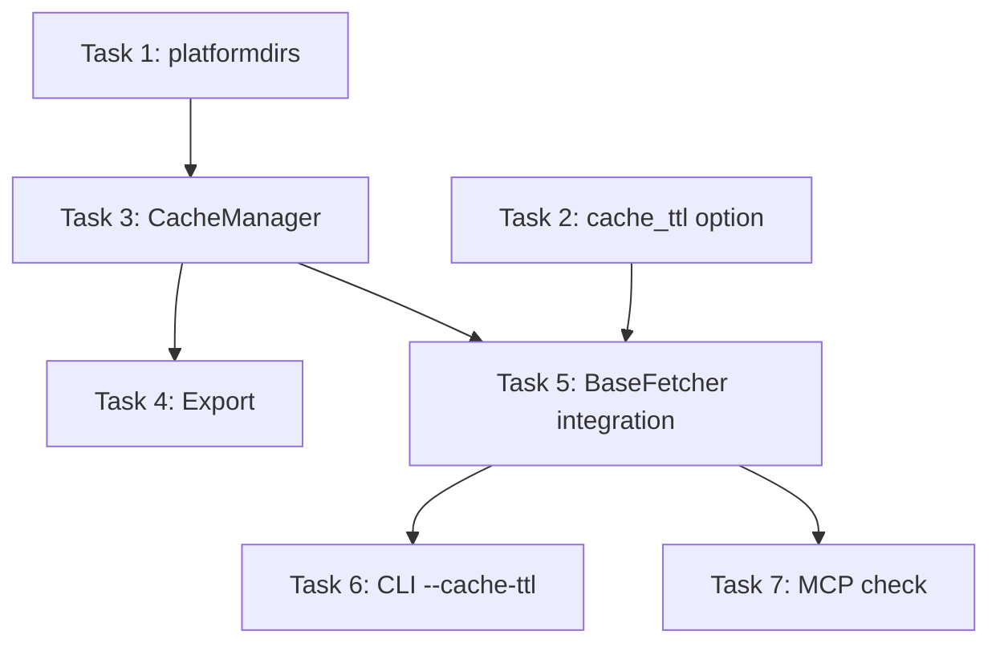

# Plan: Добавить систему кэширования с CacheManager

**Branch:** `feature/cache-manager`
**Created:** 2026-02-22
**Issue:** [#3](https://github.com/sentosango/test_conget/issues/3)

## Settings

| Setting | Value |
|---------|-------|
| Testing | No |
| Logging | Minimal (только WARN/ERROR) |
| Docs | No |

## Overview

Создать модуль `core/cache.py` с классом `CacheManager` и интегрировать автоматическое кэширование в `BaseFetcher`.

**Архитектура:**
- CacheManager использует файловое хранилище в `$XDG_CACHE_HOME/conget/{namespace}/{key}`
- Namespace = имя фетчера
- Ключ = hash(url + format + опции_фетчера)
- TTL = 0 отключает кэширование

---

## Tasks

### Phase 1: Foundation

#### Task 1: Добавить platformdirs в зависимости
- **Blocked by:** —
- **Files:** `pyproject.toml`
- **Description:** Добавить `platformdirs` в dependencies для кроссплатформенного определения путей кэша

#### Task 2: Добавить опцию cache_ttl в BaseFetcher
- **Blocked by:** —
- **Files:** `src/core/types.py`, `src/core/interfaces.py`
- **Description:** Добавить ConfigOption для cache_ttl в базовый набор опций BaseFetcher. Default: 0 (кэш отключен)

### Phase 2: CacheManager Implementation

#### Task 3: Создать CacheManager в core/cache.py
- **Blocked by:** Task 1 (platformdirs)
- **Files:** `src/core/cache.py` (новый файл)
- **Description:**
  - Создать класс CacheManager с методами: get, set, delete, clear
  - Использовать platformdirs для определения пути кэша
  - Хранилище: `~/.cache/conget/{namespace}/{key}`
  - Логирование: только WARN/ERROR

#### Task 4: Экспортировать CacheManager из core/__init__.py
- **Blocked by:** Task 3
- **Files:** `src/core/__init__.py`
- **Description:** Добавить CacheManager в экспорты модуля core

### Phase 3: Integration

#### Task 5: Интегрировать CacheManager в BaseFetcher
- **Blocked by:** Task 2, Task 3
- **Files:** `src/core/interfaces.py`
- **Description:**
  - В методе fetch(): проверять кэш перед выполнением
  - Генерировать ключ: hash(url + format + опции)
  - Сохранять FetchResult в кэш после успешного fetch
  - Сериализация FetchResult → JSON
  - TTL = 0 означает отключено

### Phase 4: CLI & MCP

#### Task 6: Добавить --cache-ttl в CLI
- **Blocked by:** Task 5
- **Files:** `src/cli/fetch.py`, `src/core/interfaces.py`, `src/cli/main.py`
- **Description:**
  - Добавить аргумент `--cache-ttl` в `src/cli/fetch.py`, `src/cli/main.py`
  - Добавить аргумент `--cache-ttl` в `run_cli()` в interfaces.py для CLI фетчеров
  - `--cache-ttl 0` отключает кэш для запроса
  - Передать значение в fetcher

#### Task 7: Проверить MCP сервер для работы с кэшем
- **Blocked by:** Task 5
- **Files:** `src/cli/mcp.py`
- **Description:**
  - Проверить что MCP использует кэш через BaseFetcher

---

## Commit Plan

При 7 задачах — 2 коммита:

| Commit | Tasks | Message |
|--------|-------|---------|
| 1 | 1-5 | `feat: add CacheManager with BaseFetcher integration` |
| 2 | 6-7 | `feat: add --cache-ttl option to CLI and MCP` |

---

## Dependencies

